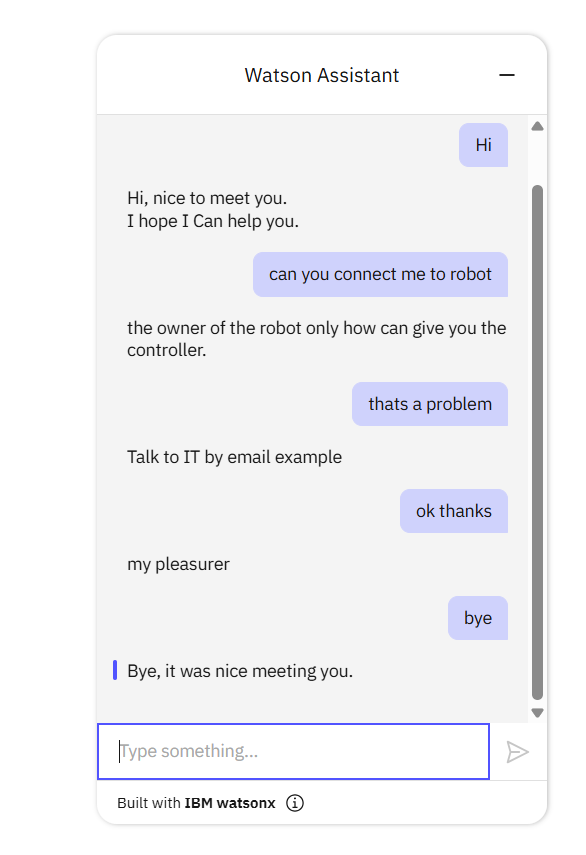

# 🤖 Watson Assistant Chatbot Integration

This project is an interactive **chatbot** built using **IBM Watson Assistant** and integrated into a **web interface**.

It is designed to simulate a smart assistant that can respond to user input based on predefined intents and entities, such as greetings, robot-related questions, and farewells.

---

## 🧠 Project Goals

- Create a chatbot that understands and responds to user queries.
- Train IBM Watson Assistant with specific intents and responses.
- Integrate the trained assistant into a web interface (HTML + JavaScript).
- Simulate a conversation related to robot support and control.

---

## 🛠️ Technologies Used

| Tool/Technology       | Purpose                           |
|-----------------------|------------------------------------|
| IBM Watson Assistant  | Building and training the chatbot |
| HTML / CSS            | Web interface design              |
| JavaScript (basic)    | Embedding Watson Assistant        |

---

## 📦 Files Structure

📁 Watson-Assistant-chatbot/ 
├── index.html # Web interface with embedded chatbot
├── skill-My-First-Skill.json # Trained Watson skill (intents/entities)
└── README.md # Project description and usage

---

## 🧩 Features

- Friendly and interactive interface
- Floating chat icon that opens the assistant when clicked
- Smart replies based on intents such as:
  - `#greetings`
  - `#connect_to_robot`
  - `#problems`
  - `#thanks`
  - `#goodbyes`

---

## 📸 Screenshots

### 🔹 Before clicking the chat icon:

### 🔹 After opening the assistant:

---

## 👩‍💻 My Role

- Trained and customized the chatbot using **Watson Assistant**
- Defined entities and intents manually in the IBM Watson skill interface
- Embedded the assistant in a simple, clean web layout using HTML
- Connected the assistant via script to the chatbot widget on the page

---

## 🚀 How to Run

> Note: You need IBM Cloud and Watson Assistant access.

1. Upload the JSON skill file (`skill-My-First-Skill.json`) into Watson Assistant.
2. Deploy the assistant and get the integration code.
3. Embed the code into `index.html`.
4. Open the `index.html` file in a browser to start chatting.

---

## 📫 Contact

For inquiries or feedback, feel free to reach out via [GitHub Profile](https://github.com/Maram-Metro)

---

## 📝 License

This project is open-source and free to use for learning and demonstration purposes.
